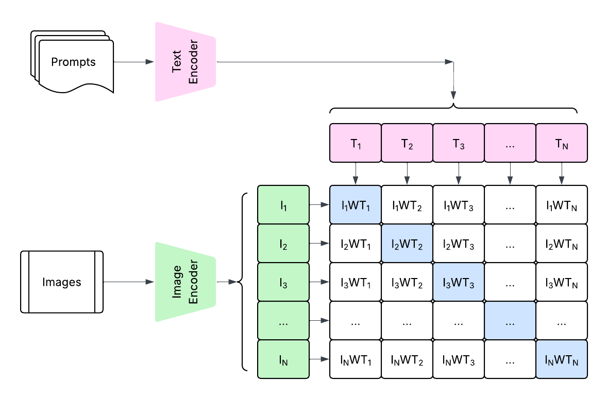

# BiCLIP: Domain Canonicalization via Structured Geometric Transformation

Official implementation for [BiCLIP: Domain Canonicalization via Structured Geometric Transformation](https://arxiv.org/abs/2603.08942)

Official implementation of BiCLIP. BiCLIP is a parameter-efficient framework designed to resolve the domain gap in Vision-Language Models (VLMs) like CLIP and SigLIP. Instead of traditional fine-tuning or unstructured adapters, BiCLIP recovers a canonical transformation that aligns image features to textual anchors using a structured bilinear head.

## What is BiCLIP?

CLIP uses is contrastively trained to reduce the dot-product of matching image and text pairs. 

$$S_{n,k} = \mathbf{i}_n \mathbf{t}_k^\top$$
 
BiCLIP adaptation of clip casts a bilinear adaptation where the model is contrastively trained to reduce the bilinear form
$$S_{n,k}^{\text{bi}} = \mathbf{i}_n \mathbf{W} \mathbf{t}_k^\top$$

where $\mathbf{W}$ is a weight matrix of size $R^{DXD}$, for a $D$ dimensional latent space. 




## Adaptability of BiCLIP
BiCLIP is adaptable to contrastive VLMs like CLIP and SigLIP. In both cases the dot product is replaced with the Bilinear term. 

Finetuning shows consistent improvement over 11 standard few-shot classification datasets. 

## 📊 Main Results (16-Shot)

We report Top-1 Accuracy (%) comparing zero-shot baselines against our structured bilinear adaptation (BiCLIP and BiSigLIP). $\Delta$ represents the gain over the respective baseline.

| Dataset | Zero-Shot CLIP | BiCLIP (Ours) | $\Delta$ | Zero-Shot SigLIP | BiSigLIP (Ours) | $\Delta$ |
| :--- | :---: | :---: | :---: | :---: | :---: | :---: |
| ImageNet | 68.84 | **71.69** | +2.85 | 74.89 | **76.73** | +1.83 |
| DTD | 42.82 | **71.86** | +29.04 | 62.23 | **73.94** | +11.70 |
| EuroSAT | 48.22 | **85.13** | +36.91 | 35.35 | **77.50** | +42.15 |
| Flowers102 | 70.99 | **94.97** | +23.99 | 81.15 | **96.11** | +14.96 |
| FGVCAircraft | 24.60 | **45.21** | +20.61 | 45.99 | **49.41** | +3.42 |
| OxfordPets | 89.04 | **93.30** | +4.24 | 92.31 | **92.80** | +0.49 |
| Food101 | 88.73 | **90.09** | +1.36 | 92.19 | **92.33** | +0.14 |
| Caltech101 | 89.93 | **93.97** | +4.04 | 95.23 | **97.06** | +1.83 |
| SUN397 | 63.50 | **74.27** | +10.77 | 65.85 | **74.24** | +8.38 |
| UCF101 | 68.07 | **82.95** | +14.88 | 71.50 | **78.85** | +7.35 |
| StanfordCars | 63.71 | **82.63** | +18.92 | 88.81 | **92.12** | +3.31 |
| **Average** | **63.31** | **80.55** | **+15.24** | **72.33** | **81.92** | **+8.69** |


[//]: # (# Bilinear CLIP and SigLIP Research Project)

[//]: # ()
[//]: # (This project explores the implementation and evaluation of **Bilinear CLIP** and **Bilinear SigLIP** models. These models extend standard Vision-Language Models &#40;VLMs&#41; by incorporating bilinear heads to improve performance on zero-shot and few-shot classification tasks across various datasets.)

## Project Structure

The repository is organized as follows:

* **`train.py`**: The main entry point for training Bilinear CLIP models. It handles configuration loading, model initialization, and the training loop.
* **`train_siglip.py`**: Specifically designed for training Bilinear SigLIP models using the SigLIP loss function.
* **`eval.py`**: Provides functionality to evaluate the zero-shot accuracy of Bilinear CLIP models and compare them against standard CLIP.
* **`eval_siglip.py`**: Similar to `eval.py`, but tailored for evaluating Bilinear SigLIP models.
* **`data_loader.py`**: Contains the logic for loading and preprocessing various datasets, including CIFAR100, OxfordPet, Flowers102, FGVCAircraft, StanfordCars, Food101, and ImageNet.
* **`losses.py`**: Implements the loss functions used during training, such as the standard contrastive loss and the SigLIP-specific loss.
* **`utils.py`**: A collection of helper functions for seeding, optimizer and scheduler creation, and dataset-specific class name processing.
* **`settings.py`**: Manages environment-specific paths for model data and datasets.
* **`visualization.py`**: A script for generating various analytical plots, such as few-shot results, angular distributions, and orthogonality analysis.

## Installation

Code is tested using the following dependencies.

```bash
torch>=2.10.0
torchvision>=0.25.0
clip @ git+https://github.com/openai/CLIP.git@ded190a052fdf4585bd685cee5bc96e0310d2c93
open_clip_torch>=3.3.0
transformers>=5.2.0
datasets>=4.6.0
timm>=1.0.25
scikit-learn>=1.8.0
scipy>=1.17.1
opencv-python>=4.13.0.92
pillow>=12.1.1

# Data Science & Numerical Processing
numpy>=2.4.2
pandas>=3.0.1
matplotlib>=3.10.8
seaborn>=0.13.2
umap-learn>=0.5.11

# Utilities & Infrastructure
huggingface_hub>=1.4.1
PyYAML>=6.0.3
tqdm>=4.67.3
requests>=2.32.5
```

Install using pip

```commandline
pip install -r requirements.txt
```

## Usage
### Training
To train a Bilinear CLIP model on a specific dataset (e.g., flowers102) with 16-shot learning:

Bash
```
python train.py -d flowers102 -n 16 -b vit16
```
To train a Bilinear SigLIP model:

Bash
```
python train_siglip.py -d flowers102 -n 16 -b vit16
```
Arguments:
```
-d, --dataset: Name of the dataset.
-n, --num_shot: Number of shots for few-shot learning (default: 16).
-b, --backbone: The VLM backbone to use (e.g., vit16).
```

### Evaluation
To evaluate the zero-shot performance of a trained model:

Bash
```
python eval.py -d flowers102 -n 16 -b vit16
```
Visualization
To generate visualizations for the experiments:

Bash
```
python visualization.py --few-shot --angular-dist --orthogonality
```

## Reproduce experimental results
### Main Results: 16-Shot Performance
Runs training and evaluation for 16-shot on BiCLIP and SigLIP.
```commandline
./reproduce_main_results.sh 16 vit16
```

### Comparison to SOTA: Few-Shot Performance Analysis
Runs training and evaluation for 1, 2, 4, 8, and 16-shot on BiCLIP and SigLIP
```commandline
./reproduce_main_results.sh vit16
```

### Supported Datasets
The project currently supports the following datasets through data_loader.py:
```
DTD
OxfordIIITPet 
Flowers102
FGVCAircraft
StanfordCars
Food101
SUN397 # Requires external download
EuroSAT
Caltech101
ImageNet # Requires external download
UCF101 # Requires external download
```
